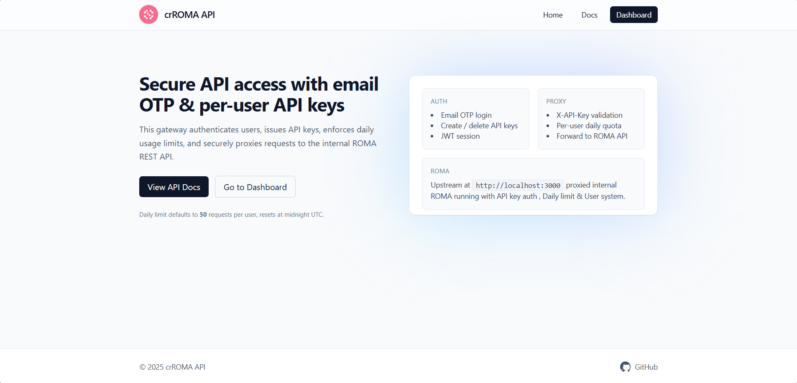

# crROMA API Proxy

A Node.js + Express web app that sits in front of your internal ROMA‑DSPy REST API and provides user accounts, email OTP login, self‑service API keys, and per‑user daily quotas. It validates X-API-Key, enforces limits, then securely proxies requests to your internal API and returns the upstream response.

Key goals:
- Manage access to ROMA API via user accounts and API keys
- Protect upstream by validating X-API-Key on every request
- Enforce per-user daily request caps (default 50/day)
- Host a friendly Docs page while blocking upstream /openapi.json, /docs, /redoc
- Simple setup: SQLite (sql.js), HTTPS via cert/key paths, minimal UI with EJS + Tailwind

## Features
- Email OTP sign up/login (Mailtrap in prod, debug fallback in dev)
- Dashboard with usage today and daily limit
- Create/Delete API keys (secret shown once)
- Per-user quotas, reset daily at midnight UTC
- Transparent proxy to INTERNAL_API_BASE when authorized
- Block access to upstream OpenAPI/Docs endpoints
- HTTPS support via node https, optional HTTP->HTTPS redirect

## Tech Stack
- Node.js, Express, EJS, Tailwind CDN
- SQLite via sql.js (no native build)
- http-proxy-middleware for proxying
- helmet, morgan, cookie-parser, jsonwebtoken

## Requirements
- Node.js 18+ (LTS recommended)
- npm

## Quick start

1) Install dependencies

```bash
npm install
```

2) Configure environment

- Copy .env.example to .env and set values
- Minimum required:
  - SITE_BASE_URL (e.g., http://localhost:3000)
  - INTERNAL_API_BASE (e.g., http://127.0.0.1:8000)
  - JWT_SECRET (random string)
  - DEFAULT_DAILY_LIMIT (e.g., 50)
- For email OTP (recommended in prod):
  - MAILTRAP_TOKEN
  - MAILTRAP_SENDER_EMAIL
  - MAILTRAP_SENDER_NAME
- For HTTPS (prod):
  - HTTPS_CERT_PATH
  - HTTPS_KEY_PATH
  - Optional HTTP_REDIRECT_PORT to enable HTTP->HTTPS redirect

3) Run (development, HTTP)

```bash
npm run dev
# or
npm start
```

4) Run (production, HTTPS)

- Provide valid cert and key paths via env
- Start the app (process supervisor recommended)

```bash
NODE_ENV=production PORT=443 npm start
```

## Environment variables
- SITE_BASE_URL: Public base URL of this proxy (used in templates)
- INTERNAL_API_BASE: Base URL of upstream ROMA API (e.g., http://127.0.0.1:8000)
- PORT: HTTPS or HTTP port for this app (default 443 in prod, 3000 in dev if TLS missing)
- HTTPS_CERT_PATH, HTTPS_KEY_PATH: TLS cert and key files for HTTPS
- HTTP_REDIRECT_PORT: Optional HTTP port for redirecting to HTTPS
- JWT_SECRET: Secret for signing dashboard session cookies
- DEFAULT_DAILY_LIMIT: Requests per day per user (default 50)
- MAILTRAP_TOKEN: Mailtrap API token (email OTP)
- MAILTRAP_SENDER_EMAIL, MAILTRAP_SENDER_NAME: Verified sender identity

## How it works
- Users sign up/login with email OTP
- They can create/delete API keys on the Dashboard
- Clients call this proxy with header X-API-Key: prefix.secret
- The proxy checks key validity and quota; if allowed, forwards the request to INTERNAL_API_BASE and returns the response
- The proxy strips the X-API-Key header before forwarding and adds x-authproxy-user
- Upstream documentation endpoints /openapi.json, /docs, and /redoc are blocked from users; a human Docs page is served at /docs

## Example requests
- Health (proxied):

```bash
curl -H "X-API-Key: YOUR_PREFIX.YOUR_SECRET" "$SITE_BASE_URL/health"
```

- Start execution (proxied):

```bash
curl -X POST -H "Content-Type: application/json" \
  -H "X-API-Key: YOUR_PREFIX.YOUR_SECRET" \
  -d '{"goal":"Analyze BTC price drivers","max_depth":2,"config_profile":"default"}' \
  "$SITE_BASE_URL/api/v1/executions"
```

## Rate limiting
- Per-user quota per UTC day
- Default daily cap is DEFAULT_DAILY_LIMIT (50 by default)
- Requests count toward quota regardless of upstream outcome

## Email OTP
- In production, configure Mailtrap API token and a verified sender
- In development without Mailtrap, the app falls back to a debug mode that surfaces OTP on the verify page/logs

## Directory layout
- src/: server code (Express app, routes, models, utils)
- views/: EJS templates (home, docs, login, verify, dashboard, key-created)
- sql/: SQLite schema (applied on first run)
- data/: sqlite database file (roma.sqlite), ignored by git
- public/: static assets (robots.txt)

## Selected routes
- GET /: Home
- GET /docs: Friendly docs for ROMA API usage
- GET /dashboard: Requires login; shows usage and keys
- POST /keys/create: Create API key (shows secret once)
- POST /keys/:id/revoke: Revoke an API key
- Any other path: Proxied to INTERNAL_API_BASE if X-API-Key is valid and within quota

## Security notes
- HTTPS enforced in production (app exits if TLS misconfigured)
- HttpOnly session cookie signed with JWT_SECRET; SameSite=Lax; Secure in prod
- CSRF protection on POST routes (double-submit cookie)
- API keys are salted and scrypt-hashed; secrets are never stored

## Deployment tips
- Run behind a reverse proxy or directly with HTTPS
- Keep cert/key files readable only by the app user
- Back up data/roma.sqlite periodically
- Consider log rotation for stdout/stderr or morgan logs

## Pushing to GitHub
- This repo includes .gitignore that excludes environment files and database
- Typical first push:

```bash
git init
git add .
git commit -m "Initial commit: ROMA Auth Proxy"
git branch -M main
git remote add origin https://github.com/<your-username>/<your-repo>.git
git push -u origin main
```

## Credits
- UI uses Tailwind CSS via CDN; favicon and logo are expected in project root
- Footer links to https://github.com/creasydude

## License
- MIT